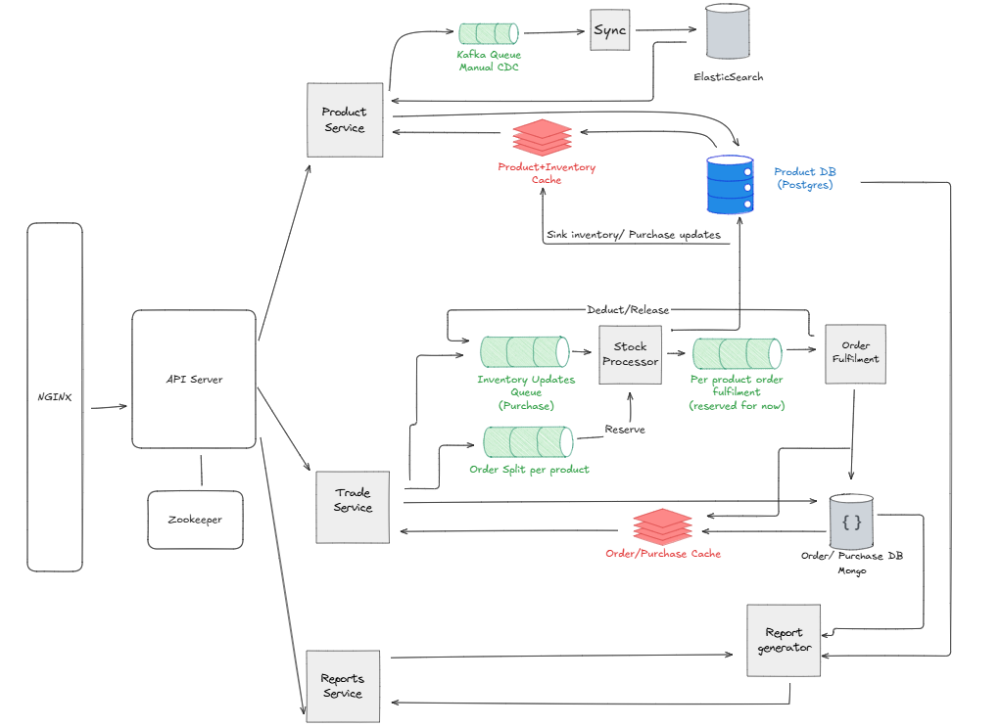

# 📦 Producto

**Producto** is a modular, scalable distributed system for managing inventory, purchases, orders, and report generation — purpose-built to handle the core needs of a distribution business.

Originally developed for a local distributor warehouse, Producto tracks live product stock, processes purchases, fulfills orders, and generates PDF invoices — all powered by a robust  distributed architecture.

### Design Features
- Distributed pattern with loosely coupled services
- Event-driven data flow using *Kafka*
- Stateful and durable stream processing with *Apache Flink*
- *Zookeeper* for service discovery and coordination
- *Nginx* for API gateway + load balancing
- Fast product lookups with *Elasticsearch*
- Scalability by design — scale modules independently
- Containerized to run seamlessly with *Docker*

## 🧩 Getting Started

#### Prerequisites: Docker
- Note: Producto has been tested and run inside a VM for reliable local deployment.

### Setup
  - Clone the repository
   ```bash
   git clone https://github.com/ankit-sharma8512/producto.git
   cd producto
   ```
  - Copy the sample ```.env.sample``` to ```.env``` inside the *docker* folder, and edit configuration values accordingly.
    - Key: Add *PRODUCT_DB_USER* and *PRODUCT_DB_PASSWORD*
  ```bash
   cp docker/.env.sample docker/.env
   ```
  - Run system setup
  ```bash
   npm run setup
   ```
  - Start Flink Job: This will register the stock processing Flink job
  ```bash
   docker exec -it jobmanager bash
   cd /producto/flink
   ./run-jobs.sh
   exit
   ```
  - Start: This will start the whole system using *Docker Compose*
  ```bash
   npm run start
   ```
  - Once running, access the system via your localhost or VM URL.

#### Dev-Mode
  - To run the system in development mode
  - Run dev system setup
  ```bash
   npm run dev-setup
   ```
  - Start Flink Job (Same as above)
  - Start: This will start the whole system using *Docker Compose* in dev mode — any file changes will automatically restart affected services.
  ```bash
   npm run dev
   ```

## 🚀 Core Architecture

Current Architecture Diagram: 

### Tech Stack

- **Runtime:** Node.js + Python
- **Message Stream:** Kafka
- **Coordination:** Zookeeper
- **Stream Processing:** Apache Flink
- **Databases:** PostgreSQL (Products), MongoDB (Orders/Purchases)
- **Cache:** Redis
- **Search:** Elasticsearch
- **API Gateway:** Nginx + API service
- **Containerization:** Docker, Docker Compose

### 🧾 Real Usage
---
Producto is in live use by a local distributor warehouse:
- Tracks products and inventory
- Processes daily purchases and orders
- Maintains real-time stock availability
- Generates PDF invoices for customers

### ✅ Status
---
Plan for next phases will enhance:
- Advanced stream processsing for analytics
- Better observability and tracing
- Better CQRS workflow

#### 🤝 Contributing
Contributions, suggestions, and discussions are always welcome!
Open an issue or PR to discuss features, ideas, or improvements.

---
**Thank you** for checking out *Producto* — hope you drop a ⭐️ if you like it!